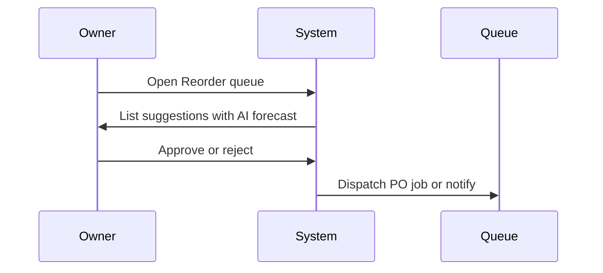
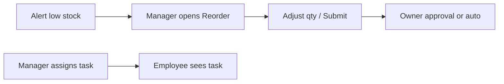
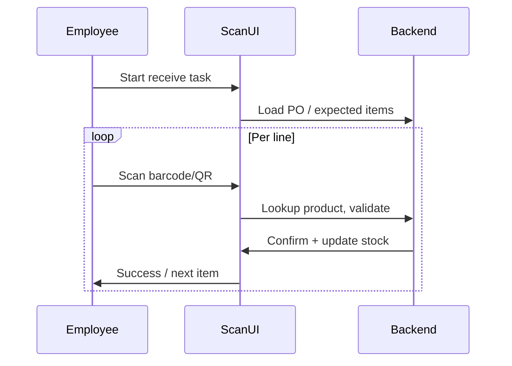
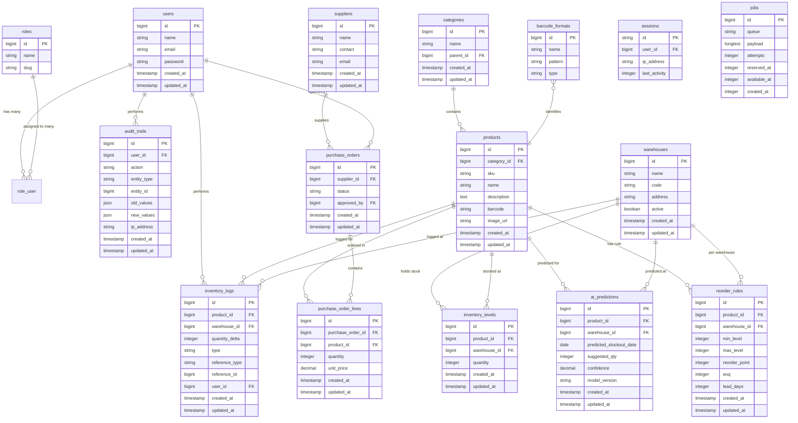

# Product Requirements Document — Smart Inventory Management System

**Version:** 1.0  
**Stack:** Laravel 12, PHP 8.2  
**Target:** High-volume warehouses requiring AI-driven insights  
**Last Updated:** February 2025

---

## Table of Contents

1. [Introduction and Scope](#1-introduction-and-scope)
2. [User Personas and Workflows](#2-user-personas-and-workflows)
3. [Functional Requirements](#3-functional-requirements)
4. [Non-Functional Requirements](#4-non-functional-requirements)
5. [AI Integration Strategy](#5-ai-integration-strategy)
6. [Database Schema Architecture](#6-database-schema-architecture)
7. [UI/UX Vision](#7-uiux-vision)
8. [MySQL / XAMPP / phpMyAdmin Setup](#8-mysql--xampp--phpmyadmin-setup)
9. [Appendix](#9-appendix)

---

## 1. Introduction and Scope

### 1.1 Purpose

This Product Requirements Document (PRD) defines the scope, requirements, and architecture for the **Smart Inventory Management System**—a web-based platform built on Laravel 12 and PHP 8.2 for high-volume warehouse operations with AI-powered forecasting, real-time synchronization, multi-warehouse support, and barcode/QR integration.

### 1.2 Scope

| In Scope | Out of Scope |
|----------|--------------|
| Stock forecasting, reordering logic, real-time sync (Reverb/Pusher) | Native mobile apps (web-first) |
| Multi-warehouse inventory and transfers | Full ERP (accounting, payroll) |
| Barcode/QR scan workflows (receive, pick, ship) | Third-party WMS integrations (future phase) |
| AI: categorization, thumbnails, chat-with-inventory | Offline-first scanning (online required) |
| Role-based access (Owner, Manager, Employee) | Custom hardware (generic scanners/browsers) |
| Audit trails and OWASP-aligned security | |

### 1.3 Definitions and Acronyms

| Term | Definition |
|------|------------|
| **PRD** | Product Requirements Document |
| **OWASP** | Open Web Application Security Project; reference for secure coding (e.g. Top 10) |
| **Reverb** | Laravel Reverb—Laravel’s first-party WebSocket server for real-time broadcasting |
| **Pusher** | Third-party real-time API (alternative to Reverb for WebSockets) |
| **SKU** | Stock Keeping Unit; unique product identifier |
| **EOQ** | Economic Order Quantity; optimal order size formula |
| **WMS** | Warehouse Management System |
| **NL** | Natural Language (e.g. chat-with-inventory queries) |
| **API** | Application Programming Interface |

---

## 2. User Personas and Workflows

### 2.1 Persona Summary

| Persona | Focus | Key Workflows |
|---------|--------|----------------|
| **Owner** | Analytics, finance, strategy | View dashboards; run reports; approve reorders/budgets; export data; manage warehouses and users |
| **Manager** | Operations, staff, day-to-day | Assign tasks; view real-time stock; handle reorder suggestions; manage staff; audit logs; low-stock alerts |
| **Employee** | Scanning, shipping, receiving | Scan barcode/QR; receive/putaway; pick and pack; ship; view own task list; minimal reporting |

### 2.2 Owner Persona

**Description:** The Owner is a business decision-maker who uses the system for financial and strategic oversight. They care about profitability, restock costs, and high-level KPIs across all warehouses. They typically access the system from a desktop during business hours.

**Goals:** Optimize capital tied in inventory, reduce stockouts and overstock, approve large reorders and budgets, and export data for external reporting (e.g. accountants, boards).

**Pain Points:** Lack of predictive insight into when to restock; manual approval bottlenecks; difficulty comparing performance across warehouses; no single source of truth for inventory value.

**Primary Workflows:**

- **View analytics dashboard** — Log in → Dashboard (KPIs: total value, low-stock count, reorder pending count, forecast alerts) → Drill into warehouse or product reports.
- **Approve reorders / budgets** — Notifications or Reorder queue → Review suggested orders (with AI forecast context) → Approve or reject (with optional comment) → System creates purchase orders or sends to supplier.
- **Export data** — Reports → Select report type and date range / warehouse → Export (CSV/PDF) → Download.

### 2.3 Manager Persona

**Description:** The Manager runs daily operations: ensuring stock levels are accurate, staff are assigned, and reorder suggestions are acted upon. They need real-time visibility and the ability to correct discrepancies and manage staff access.

**Goals:** Keep inventory accurate and available; avoid stockouts; delegate receive/pick/ship tasks; audit who did what and when; respond to low-stock and reorder alerts.

**Pain Points:** Delayed visibility when stock changes in another tab or by another user; manual reorder decisions without guidance; tracking down who received or shipped what.

**Primary Workflows:**

- **Handle reorder suggestions** — Reorder queue / Alerts → View suggested quantity and rule (min/max, EOQ, forecast) → Adjust if needed → Submit for approval (Owner) or auto-approve per policy.
- **Assign tasks to staff** — Tasks / Assignments → Select employee and task type (receive, pick, ship) → Assign → Employee sees task in their queue.
- **View real-time stock and audit** — Inventory list (live updates via Reverb/Pusher) → Filter by warehouse/product → Click product → View movement history and audit trail.

### 2.4 Employee Persona

**Description:** The Employee is a warehouse floor user who performs receiving, putaway, picking, and shipping. They interact primarily via scan (barcode/QR) and a simplified task-focused UI, often on a tablet or handheld device.

**Goals:** Complete assigned tasks quickly and correctly; scan to confirm actions; see only what they need (e.g. next pick, ship list).

**Pain Points:** Slow or unclear scan feedback; complex screens; uncertainty about which location or product to scan next.

**Primary Workflows:**

- **Receive shipment** — Log in → Receive task → Scan or enter PO/supplier doc → For each item: scan barcode/QR → Enter quantity (or confirm) → System updates stock and logs; optional putaway location scan.
- **Pick and pack** — Pick task → View pick list (product, quantity, location) → Go to location → Scan product/location to confirm → Mark complete; repeat for all lines.
- **Ship order** — Ship task → View order lines → Scan each product (or shipment ID) to verify → Confirm ship → System deducts stock and logs.

### 2.5 Workflow Diagrams (Mermaid)

**Owner: Approve reorder (high-level)**



**Manager: Handle low-stock and assign task**



**Employee: Receive shipment via scan**



---

## 3. Functional Requirements

### 3.1 Functional Requirements Table

| ID | Name | Description | Priority | Primary Persona |
|----|------|-------------|----------|-----------------|
| FR-1 | AI-powered stock forecasting | Predict when to restock based on historical data (sales, seasonality, lead times). Output: suggested restock date and quantity. | Must | Owner, Manager |
| FR-2 | Automated reordering logic | Rules engine: min/max levels, reorder point, EOQ, supplier lead time. Approval workflow: auto vs manager/owner approval. | Must | Owner, Manager |
| FR-3 | Real-time inventory sync | Laravel Reverb or Pusher: broadcast events on stock change so all clients (multi-tab, multi-user) see updates within seconds. | Must | Manager, Employee |
| FR-4 | Multi-warehouse support | Warehouses as first-class entities; stock levels per warehouse; inter-warehouse transfers; reporting per warehouse and consolidated. | Must | Owner, Manager |
| FR-5 | Barcode / QR integration | Scan to identify product or location; support receive, pick, ship via scan; support multiple code types/formats (EAN, UPC, Code128, QR). | Must | Employee, Manager |
| FR-6 | Audit trail | Log who did what and when (receipts, picks, ships, transfers, reorder approvals) for compliance and troubleshooting. | Must | Owner, Manager |
| FR-7 | Role-based access | Distinct permissions for Owner (full), Manager (operations + staff), Employee (tasks + scan only). | Must | All |
| FR-8 | Chat-with-inventory (NL) | Natural language queries over inventory (e.g. “What’s low in Warehouse A?”) with answers scoped by role/warehouse. | Should | Owner, Manager |
| FR-9 | AI product categorization | Suggest or assign product category from name/description using AI; human override. | Should | Manager |
| FR-10 | AI-generated thumbnails | Generate product thumbnail when image is missing (e.g. via AI image API). | Could | Manager |

### 3.2 FR-1: AI-Powered Stock Forecasting

- **Inputs:** Historical inventory_logs (movements, adjustments), sales/fulfillment data (if available), lead times per supplier/product, seasonality parameters.
- **Outputs:** Suggested restock date, suggested quantity, confidence or risk indicator; stored in `ai_predictions` (or equivalent).
- **Trigger:** Scheduled job (e.g. nightly) and/or on-demand from dashboard or reorder screen.
- **Dependencies:** Sufficient historical data; definition of “stock out” or “below reorder point” for training/evaluation.

### 3.3 FR-2: Automated Reordering System Logic

- **Rules:** Min/max levels, reorder point, EOQ formula, supplier lead time; rules can be per product, per warehouse, or per category.
- **Flow:** When stock falls below reorder point (or forecast indicates stockout by date), system generates reorder suggestion. Configurable: auto-create PO, or send to Manager/Owner for approval.
- **Data:** Reorder rules stored in `reorder_rules`; suggestions and approvals in `purchase_orders` or dedicated `reorder_suggestions` table.

### 3.4 FR-3: Real-Time Inventory Synchronization

- **Technology:** Laravel Reverb (preferred) or Pusher.
- **Channels/Events (examples):**
  - `inventory.updated` — payload: product_id, warehouse_id, new quantity, user_id, timestamp.
  - `inventory.low_stock` — payload: product_id, warehouse_id, current quantity, reorder_point.
- **Client:** Front-end subscribes to channel(s) by warehouse or global; updates tables/cards without full page reload. Target: &lt;5 s from server event to UI update.

### 3.5 FR-4: Multi-Warehouse Support

- **Entities:** `warehouses` table; `inventory_levels` (or equivalent) keyed by product + warehouse.
- **Transfers:** Create transfer (from warehouse, to warehouse, product, quantity) → deduct from source, add to destination; log in `inventory_logs` and optional `transfers` table.
- **Reporting:** All stock and movement reports filterable by warehouse; consolidated “total stock” across warehouses where applicable.

### 3.6 FR-5: Barcode / QR Integration

- **Scan flow:** Client captures barcode/QR string → API validates and resolves to product_id (or location_id). Then application logic performs receive/pick/ship action.
- **Formats:** Support at least EAN-13, UPC-A, Code 128, QR (e.g. product URL or JSON with product_id). Configurable formats in `barcode_formats` or config.
- **Fallback:** Manual product/location search by name or SKU when scan fails or is unavailable.

---

## 4. Non-Functional Requirements

### 4.1 Security (OWASP Alignment)

| OWASP Risk / Area | Mitigation |
|-------------------|------------|
| A01 Broken Access Control | Role-based middleware; policy checks on every inventory and reorder action; scope by warehouse where applicable. |
| A02 Cryptographic Failures | TLS for all traffic; hash passwords (bcrypt/argon2); no sensitive data in URLs or logs. |
| A03 Injection | Parameterized queries (Eloquent/DB); validated input; no raw user input in SQL. |
| A04 Insecure Design | Threat model for inventory and approvals; least privilege by default. |
| A05 Security Misconfiguration | Secure .env; disable debug in production; secure headers (CORS, CSP). |
| A06 Vulnerable Components | Composer/npm audit; keep Laravel and dependencies updated. |
| A07 Auth/Session Failures | Strong session config; CSRF on state-changing requests; secure cookie flags. |
| A08 Software/Data Integrity | Verify dependencies; integrity checks for critical data if needed. |
| A09 Logging/Monitoring Failures | Audit trail for inventory and approvals; log auth failures and sensitive actions. |
| A10 SSRF / XSS | Sanitize output (Blade escaping); restrict outbound calls (e.g. AI APIs) to allowlist. |

### 4.2 Performance

- **Target:** &lt;200 ms response time (p95) for critical endpoints.
- **Critical endpoints (examples):** Scan lookup (resolve barcode to product), Stock check (single product/warehouse), Dashboard summary (cached KPIs), Add/update inventory line (single mutation).
- **Measures:** DB indexing on `inventory_levels(product_id, warehouse_id)`, `inventory_logs` (product_id, warehouse_id, created_at); Redis cache for dashboard aggregates and hot product lookups; heavy AI/forecast jobs run asynchronously via queue (excluded from 200 ms target).

### 4.3 Scalability

- **Application:** Stateless web tier; horizontal scaling behind load balancer; session in database or Redis.
- **Queue:** Dedicated workers for AI, notifications, and export jobs; scale workers independently.
- **Database:** Use read replicas for report and dashboard queries where applicable; writes to primary.
- **Real-time:** Reverb (or Pusher) scaling per Laravel/docs; consider multiple Reverb instances or Pusher plan for high connection count.

---

## 5. AI Integration Strategy

### 5.1 AI Use-Cases Table

| Use Case | Data In | Data Out | SDK / Service | Risk / Consideration |
|----------|---------|----------|---------------|----------------------|
| Stock forecasting | inventory_logs, sales, lead times | Restock date, suggested qty, confidence | Laravel AI SDK + time-series model or external API | Data quality; explainability for approvals |
| Product categorization | Product name, description | Suggested category_id, confidence | Laravel AI SDK (e.g. OpenAI/Claude) | Override required; cost per call |
| Thumbnail generation | Product name/category (no image) | Image URL or blob | OpenAI DALL·E or Stability API | Cost; appropriateness of generated images |
| Chat-with-inventory | Natural language query + user context | Answer (text or structured) | Laravel AI SDK + LLM; optional intent/entity layer | Scope by role/warehouse; rate limits; prompt injection |

### 5.2 Stock Forecasting (AI/ML)

- Use Laravel AI SDK or external ML API for time-series prediction.
- **Data source:** `inventory_logs`, optional sales/orders tables.
- **Output:** Write to `ai_predictions` (product_id, warehouse_id, predicted_stockout_date, suggested_qty, model_version, created_at).
- Run as scheduled job (e.g. daily); optionally trigger on-demand from UI.

### 5.3 Automated Product Categorization

- On product create/import (or batch job): send name/description to AI; get suggested category and confidence.
- Store suggestion; allow Manager to accept or override. Final category_id stored on `products`.

### 5.4 Image Generation for Thumbnails

- When product has no image: optional job calls AI image API with product name/category to generate thumbnail; store URL or file in product asset storage; fallback to placeholder if generation fails or is disabled.

### 5.5 Chat-with-Inventory (Natural Language)

- **Architecture:** User input → (optional) intent/entity extraction → query builder or LLM with context (inventory schema, user’s warehouses/roles). Response as text or structured (e.g. “5 items below reorder in Warehouse A”).
- **Security:** Authenticate user; scope data by role and assigned warehouses; sanitize input to reduce prompt injection; rate limit per user.

---

## 6. Database Schema Architecture

### 6.1 Entity Groups (Textual Map)

- **Identity:** `users`, `roles`, `role_user` (pivot). Users have one or more roles (Owner, Manager, Employee); auth and policy checks use these.
- **Inventory core:** `warehouses`, `categories`, `products`, `inventory_levels` (product_id, warehouse_id, quantity). Products belong to category; inventory_levels is the current stock per product per warehouse.
- **Movements and history:** `inventory_logs` (product_id, warehouse_id, quantity_delta, type: receive/pick/ship/adjust/transfer, reference_id, user_id, created_at). Optional `transfers` table for transfer header/detail.
- **Purchasing / reordering:** `suppliers`, `reorder_rules` (product_id or category_id, warehouse_id, min, max, reorder_point, eoq, lead_days), `purchase_orders` (supplier_id, status, approved_by, created_at), `purchase_order_lines` (product_id, quantity, etc.).
- **AI:** `ai_predictions` (product_id, warehouse_id, predicted_stockout_date, suggested_qty, confidence, model_version, created_at). Optional `chat_sessions` for chat-with-inventory history.
- **Audit and system:** `audit_trails` (user_id, action, entity_type, entity_id, old/new values, ip, created_at). Laravel defaults: `sessions`, `cache`, `jobs`, `failed_jobs`, `password_reset_tokens`.

### 6.2 Entity Relationship Diagram (Mermaid)



### 6.3 Table Reference List

| Table | Purpose | Key Columns |
|-------|---------|-------------|
| `users` | System users (Owner, Manager, Employee) | id, name, email, password |
| `roles` | Role definitions | id, name, slug |
| `role_user` | User–role pivot | user_id, role_id |
| `warehouses` | Warehouse master | id, name, code, address, active |
| `categories` | Product categories (hierarchical) | id, name, parent_id |
| `products` | Product master | id, category_id, sku, name, barcode, image_url |
| `inventory_levels` | Current stock per product per warehouse | id, product_id, warehouse_id, quantity |
| `inventory_logs` | All stock movements (receive, pick, ship, adjust, transfer) | id, product_id, warehouse_id, quantity_delta, type, reference_*, user_id |
| `reorder_rules` | Min/max, reorder point, EOQ, lead time per product/warehouse | id, product_id, warehouse_id, min_level, max_level, reorder_point, eoq, lead_days |
| `suppliers` | Supplier master | id, name, contact, email |
| `purchase_orders` | Reorder/PO header | id, supplier_id, status, approved_by |
| `purchase_order_lines` | PO line items | id, purchase_order_id, product_id, quantity, unit_price |
| `ai_predictions` | Forecast output (restock date, suggested qty) | id, product_id, warehouse_id, predicted_stockout_date, suggested_qty, confidence, model_version |
| `audit_trails` | Who did what, when (compliance) | id, user_id, action, entity_type, entity_id, old_values, new_values, ip_address |
| `barcode_formats` | Supported barcode/QR formats and patterns | id, name, pattern, type |
| `sessions` | Laravel sessions | id, user_id, last_activity |
| `cache` | Laravel cache | key, value, expiration |
| `jobs` | Queued jobs | id, queue, payload, attempts |
| `failed_jobs` | Failed job log | id, connection, queue, payload, exception |
| `password_reset_tokens` | Password reset | email, token, created_at |

---

## 7. UI/UX Vision

### 7.1 Design System: Smart Minimalist

- **Principles:** Data-dense but clean; dark mode default; glassmorphism (frosted panels, subtle borders, light blur); clear hierarchy and limited color palette so charts and numbers stand out.
- **Tone:** Professional, efficient; minimal decoration; focus on KPIs, tables, and actions.

### 7.2 Dark Mode and Glassmorphism

- **Dark mode:** Default theme; background dark gray/blue (#0f172a–#1e293b); card/panel background with transparency and backdrop blur (glassmorphism).
- **Surfaces:** Cards and modals use semi-transparent backgrounds (e.g. rgba(30,41,59,0.8)) and border (e.g. 1px solid rgba(255,255,255,0.08)).
- **Typography:** High-contrast text (white/light gray); headings bold and sized for hierarchy; monospace or tabular figures for numbers.

### 7.3 Key Screens Reference

| Screen | Primary Persona | Key Elements |
|--------|-----------------|--------------|
| Dashboard | Owner, Manager | KPI cards (total value, low-stock count, reorder pending); charts (trends, by warehouse); “Live” indicator; last sync time |
| Inventory list/detail | Manager, Owner | Table with filters (warehouse, category, low stock); real-time quantity updates; link to movement history and audit |
| Scan UI | Employee | Large scan input; product/location confirmation; next step CTA; minimal nav |
| Reorder queue / Approval | Owner, Manager | List of suggestions with AI forecast; approve/reject; filters by warehouse/supplier |
| Chat-with-inventory | Owner, Manager | Input box; response area (text or structured); scope indicator (e.g. “Warehouse A”) |
| Settings | Owner, Manager | Warehouses CRUD; users and roles; reorder policy (auto vs approval); barcode format config |

### 7.4 Components

- **Cards:** Glassmorphism panel for KPIs and chart containers.
- **Tables:** Sortable, filterable; row highlight on low stock; real-time badge or “Updated just now” where applicable.
- **Charts:** Line/bar for trends and comparisons; consistent palette; legends and tooltips.
- **Navigation:** Sidebar or top nav; role-based menu items (Owner sees Analytics/Settings; Employee sees Tasks/Scan).
- **Modals:** Confirmations (e.g. approve reorder, ship order); forms in modal where appropriate.
- **Real-time indicators:** “Live” badge when WebSocket connected; “Last updated: X s ago” for key widgets.

### 7.5 Responsiveness

- **Desktop-first:** Primary use on desktop (Owner/Manager dashboards, reports).
- **Tablet:** Full support for warehouse devices (Manager and Employee); touch-friendly scan and task UIs.
- **Mobile:** Read-only or quick checks (e.g. stock lookup); complex workflows optimized for tablet/desktop.

---

## 8. MySQL / XAMPP / phpMyAdmin Setup

### 8.1 Prerequisites

- XAMPP installed (Apache, MySQL, PHP 8.2+).
- Laravel 12 project at `c:\xampp\htdocs\Smart-Inventory-Management-System`.
- phpMyAdmin available (e.g. http://localhost/phpmyadmin).

### 8.2 Environment Configuration

Configure `.env` for MySQL:

```env
DB_CONNECTION=mysql
DB_HOST=127.0.0.1
DB_PORT=3306
DB_DATABASE=smart_inventory
DB_USERNAME=root
DB_PASSWORD=
```

Use a strong password for `DB_PASSWORD` in production; for local XAMPP default is often empty.

### 8.3 Database Creation

**Option A — phpMyAdmin**

1. Open http://localhost/phpmyadmin.
2. Click “New” (or “Databases”).
3. Database name: `smart_inventory`.
4. Collation: `utf8mb4_unicode_ci` (or `utf8mb4_general_ci`).
5. Click “Create”.

**Option B — MySQL CLI (XAMPP shell or mysql client)**

```bash
mysql -u root -p -e "CREATE DATABASE smart_inventory CHARACTER SET utf8mb4 COLLATE utf8mb4_unicode_ci;"
```

### 8.4 Laravel Migrations

From the project root:

```bash
cd c:\xampp\htdocs\Smart-Inventory-Management-System
php artisan migrate
```

This runs all migrations in `database/migrations/`. The PRD schema (Section 6) defines the target state; implement migrations in a later phase to create the tables listed in Section 6.3 (e.g. `warehouses`, `categories`, `products`, `inventory_levels`, `inventory_logs`, `reorder_rules`, `suppliers`, `purchase_orders`, `purchase_order_lines`, `ai_predictions`, `audit_trails`, `barcode_formats`, `roles`, `role_user`). Existing Laravel migrations create `users`, `sessions`, `cache`, `jobs`, `failed_jobs`, `password_reset_tokens`.

### 8.5 Seed Data (Recommended for Demo)

| Seeder | Purpose | Data |
|--------|---------|------|
| RoleSeeder | Roles | owner, manager, employee |
| UserSeeder | Admin user | 1 user with owner role |
| WarehouseSeeder | Warehouses | 2 warehouses (e.g. Main, Secondary) |
| CategorySeeder | Categories | 3–5 categories |
| ProductSeeder | Products | 10–20 products with SKU/barcode |
| InventoryLevelSeeder | Initial stock | Quantity per product per warehouse |
| InventoryLogSeeder | Sample history | 10–20 log entries |
| AiPredictionSeeder | Demo AI output | 2–5 prediction rows |

Run seeders after migrations:

```bash
php artisan db:seed
```

Or specific seeders:

```bash
php artisan db:seed --class=RoleSeeder
php artisan db:seed --class=WarehouseSeeder
# ... etc.
```

### 8.6 Setup Summary Table

| Step | Action | Tool |
|------|--------|------|
| 1 | Set `.env` DB_* to MySQL and `smart_inventory` | Editor |
| 2 | Create database `smart_inventory` | phpMyAdmin or MySQL CLI |
| 3 | Run `php artisan migrate` | Artisan |
| 4 | (Optional) Run `php artisan db:seed` | Artisan |
| 5 | Verify tables in phpMyAdmin | phpMyAdmin |

---

## 9. Appendix

### 9.1 Glossary

- **Reorder point:** Inventory level at which a reorder is triggered.
- **EOQ:** Economic Order Quantity; formula-based optimal order size to minimize holding + ordering cost.
- **Lead time:** Days from order placement to stock receipt.
- **Glassmorphism:** UI style using semi-transparent, blurred panels.
- **WebSocket:** Full-duplex connection for real-time server–client updates (e.g. Laravel Reverb).

### 9.2 Reference Links

- [Laravel 12.x Documentation](https://laravel.com/docs/12.x)
- [Laravel Reverb (Broadcasting)](https://laravel.com/docs/reverb)
- [OWASP Top 10](https://owasp.org/www-project-top-ten/)
- [Laravel AI SDK](https://laravel.com/docs/ai) (or current AI integration docs)

### 9.3 Document History

| Version | Date | Author | Changes |
|---------|------|--------|---------|
| 1.0 | February 2025 | — | Initial PRD (personas, FR/NFR, AI strategy, schema, UI vision, MySQL setup) |

---

*End of Product Requirements Document*
